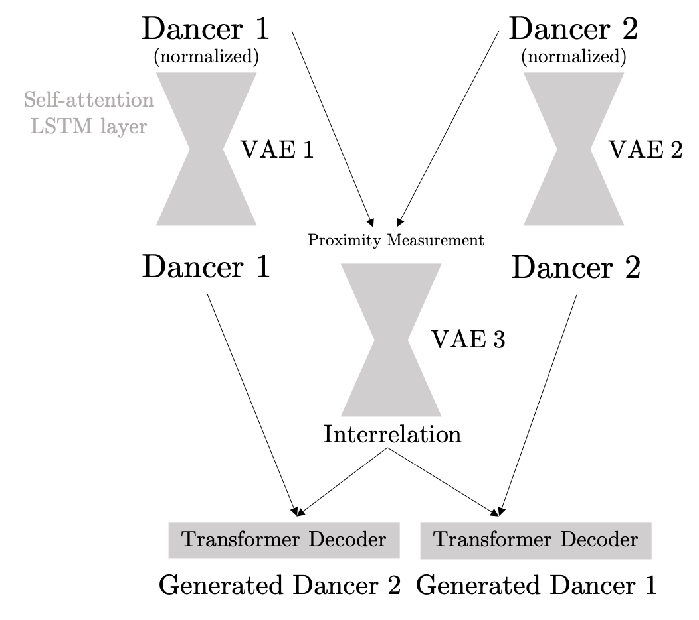
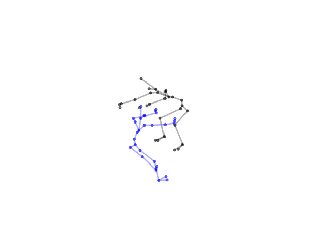
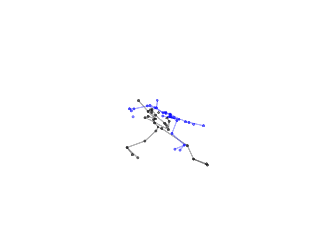
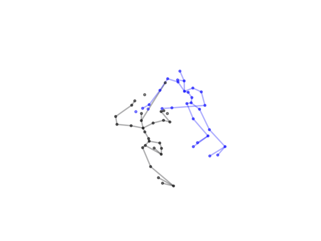
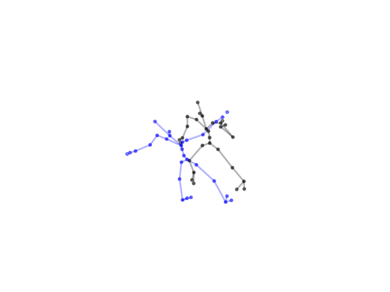
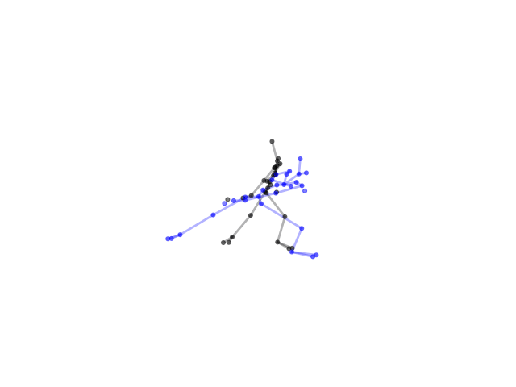
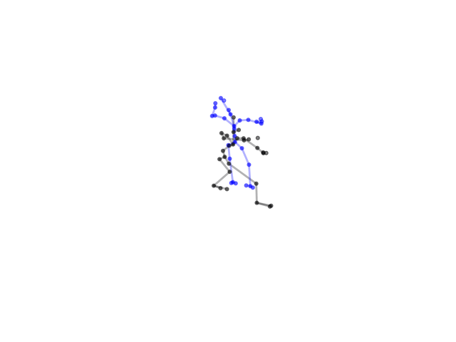

## Welcome to ChoreoAI!
Hi guys! Welcome to my repository for [Google Summer of Code 2024 - AI-Generated Choreography - from Solos to Duets](https://humanai.foundation/gsoc/2024/proposal_ChoreoAI1.html). This project focuses on leveraging cutting-edge AI technologies to innovate the way choreographies are created, focusing particularly on duets. This is my [Contributor Profile of GSoC](https://summerofcode.withgoogle.com/programs/2024/projects/PEvVr15z). To learn more about the developmental insights, check out my [blog post](https://wang-zixuan.github.io/posts/2024/gsoc_2024).

For a hands-on experience, dive into my [Google Colab Notebook](https://colab.research.google.com/drive/1_UhiZ3LczwTCqnzfObKShWeaYSLlvwzW?usp=sharing) which provides an interactive demonstration of the network.

I also would like to express my heartfelt thank you to my incredible mentors [Mariel Pettee](https://marielpettee.com/) and [Ilya Vidrin](https://www.ilyavidrin.com/) for their invaluable guidance, and my collegue, [Luis Zerkowski](https://github.com/Luizerko), for his collaborative efforts and insights from his [project](https://github.com/humanai-foundation/ChoreoAI/tree/main/ChoreoAI_Duet_ChorAIgraphy_Luis_Zerkowski).

## Goals
### Problem Addressed
This project aims at developing AI-generated choreography for duets. It outlines a novel approach leveraging Transformer and Variational Autoencoder to analyze and generate dance movements, focusing on creating authentic dance material that reflect the intricate dynamics between dancers.

### Solution Approach 
The project uses **probability-based Transformer and Variational Autoencoder** to process motion capture data. 

The comprehensive solution plan involves:
- Understand key relationships between parts of the body of each dancer through a dedicated VAE containing self-attention layers and LSTM layers
- Design a Duet VAE to learn key interaction between two dancers
- Propose a probability-based method to restrict model to focus only on reconstruction of dancer data
- Enhance the overall coherence of the generated choreography by implementing regression loss and velocity loss

### Key Deliverables
- Create a dataset of point-cloud data corresponding to extracted motion capture poses from videos of dance duets
- Utilize Transformer model with encoder-decoder structure and various attention mechanisms to generate the movements of Dancer #2 conditioned on the inputs of Dancer #1
- Implement a Spatial/Temporal Joint Relation Module to learn key relationships between parts of the body of each dancer that are integral to the dynamics of the duet
- Collaborate with the original dancers to use the model outputs to inspire new performance material

## Repository Hierarchy
```
.
├── data                       # Scripts for data processing and augmentation
├── dataset                    # Processed 3D joint datasets
├── evaluation_test            # Evaluation test before officially admitted by GSoC 2024
├── gsoc_vis                   # Visualization of model outputs
├── job-gpu.sh                 # GPU job submission script
├── loss                       # Loss functions implementation
├── model                      # Model architecture and training scripts
├── model_weights              # Trained model weights
├── plot.py                    # Script for plotting results
├── pose_extraction            # Pose extraction from video data
├── README.md                  # Repository documentation
├── test_functions_for_colab_demo.py  # Test functions for Colab demonstrations
├── test.py                    # Testing scripts
├── train.py                   # Training pipeline
└── utils                      # Utility scripts for logging and other functions
└── visualization.ipynb        # Jupyter Notebook for result visualization
```

## Detailed Solution
### Data preparation
For comprehensive details on converting raw duet videos into 3D joint data, please refer to our [pose extraction documentation](pose_extraction/README.md).

### Model Structure
<div align="center">
  
</div>

The model includes 3 VAEs, separately for dancer 1, dancer 2, and duet. Each VAE contains encoder and decoder, and encoder contains self-attention layer and LSTM layer. VAE for duet will receive original data of dancer 1 and dancer 2, and calculate the distance between two dancers to measure proximity. Then, it will generate two sequences representing interrelation for each dancer. It will be combined with the generated output from VAE for single dancer and passed to transformer decoder, and then generate the motion in the next time step.

For more architectural details, visit our [model documentation](model/README.md).

### Generated Results

The following visualizations showcase the output of our model (blue) in comparison to the original dance movements (black):

<div align="center">
    
    
    
</div> 



