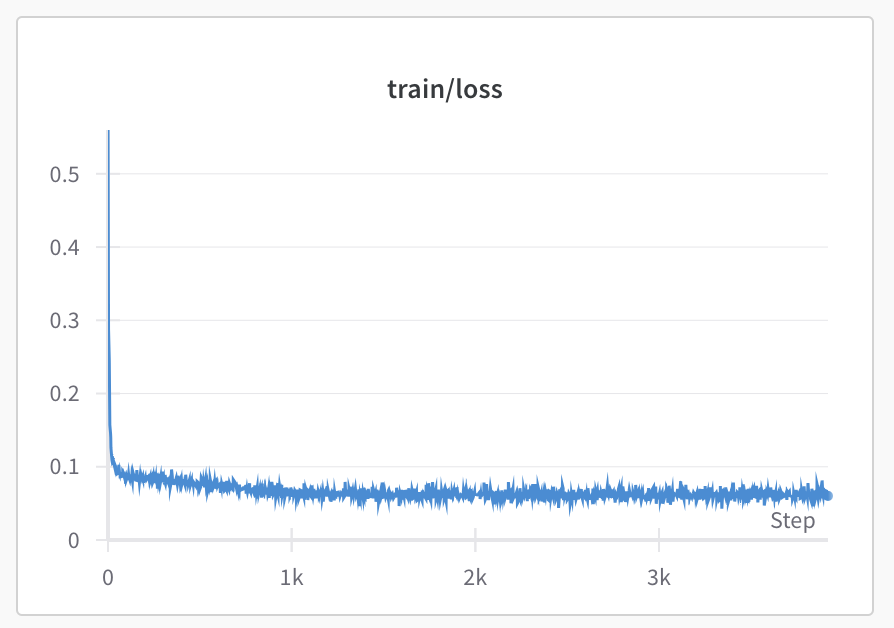
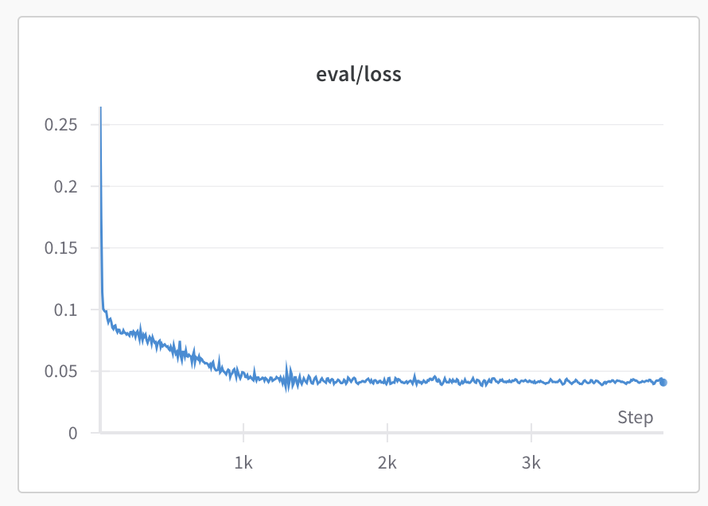

# AI-Generated Choreography - from Solos to Duets

## Introduction
This is the submission for GSoC [AI-Enabled Choreography](https://humanai.foundation/gsoc/2024/proposal_ChoreoAI1.html). In this project, I trained a generative model using VAE + LSTM layers to generate new sequences of a dancer.

## Part 1: Visualize the data
I followed [this repo](https://github.com/mariel-pettee/choreo-graph/blob/main/functions/plotting.py) to visualize motion capture [data](https://github.com/mariel-pettee/choreo-graph/tree/main/data). The code provides visualization of `seq` and `ghost` in a 3D space, which is convenient for us to view the difference between original sequence and generated sequence.

## Part 2: Train a generative model
### Model selection
I utilized VAE structure with LSTM layers. The reason why I choose this structure is that LSTM is suitable for processing sequential data and can learn the long-term dependencies. Compared to LSTM, GNN is more suitable for processing graph-structured data. Our motion capture data do have “joints” and edge information of the body, but the two main reasons why I didn’t use GNN are: 1) Our task primarily focuses on generating sequential data, not the relationship between different joints; 2) GNN will have much higher computational demand than LSTM due to computation of adjacency matrix.

I trained two modelw using static images and sequences separately. Currently, the model which uses static images of the dancer outperforms the one that uses sequential data (lower loss). I acknowledge that the output sequences show jittery behavior and require further optimization.

### Data processing
- Data preprocessing: center all data
- 70% train data, 15% validation data, 15% test data
- `seq_len=64`, no overlap

### Model design
The model follows the general structure of VAE, containing an encoder and a decoder, where the encoder consists 2 LSTM layers, 2 linear layers for mean and log variance in the latent space. In the decoder, there is a linear layer with ReLU activation, 2 LSTM layers, and an output smooth layer. I also used the reparameterization trick to reformulate the sampling step into a differentiable operation. 

To find the best model, I trained it with different configurations and computed the validation error. For example, I tested different values of `latent_dim` and `n_units` in LSTM layers of encoder and decoder, both beginning with 32. Finally, the test results showed that larger values of `latent_dim` and `n_units` had better performance, so I chose `latent_dim` to be 256 and `n_units` to be 394. 

Furthermore, I tested with adding a rotation layer to achieve data augmentation, but it showed no performance improvement.

Two separate models with `seq_len=64` and `seq_len=1` were trained with MSE loss and KL divergence loss. The model was trained with `1000` epochs with Adam optimizer and multi-step learning rate scheduler when `seq_len=64`, and trained with `500` epochs when `seq_len=1`. Initially, I set the `epoch` to be a much smaller value (e.g., ~100), but the output would be static and the total loss didn't decrease. 

Due to time limit and GPU memory limit, I could only train with non-overlapping data with `seq_len=64`. In the future weeks, I would test with overlapping data and longer sequence length to improve the performance of the model.

### Results

The above two figures show the training loss and evaluation loss when I trained the model with `seq_len=64` using wandb tool. The training loss stabilized around `0.05`.  

The generated result now showed a jittery fashion, propably due to limited `seq_len` during training. However, I believe the model managed to learn the core features of the input.

When I generated new data conditioned on the test sequence, if $\sigma$ increased, the output would have some variations with the original input, demonstrating the capability of the model to sample from the latent space and reconstruct a sequence. With higher value of $\sigma$ (> 0.5), the output would have a greater range of motion when compared to the test sequence.

When I generated new data randomly, the model trained with static images was not able to generate a realistic sequence. This was mainly due to the fact that the model only learned 2D data and didn't see any temporal information. On the contrary, the model trained with sequential data was able to generate at least a reasonable sequence.

## Part 3: Why this project?
### My interest in this project

This project poses an exciting challenge that fuses AI and art, which aligns well with my passion to push the boundaries of AI. With 2+ years’ experience in CV/AI field, I mainly focused on utilizing vision data to complete real-world tasks. Here is a list of projects I have worked on:
- Depth estimation of spatial-temporal stereo event video streams (master’s thesis @ NJU)
- Image super-resolution and denoising using generative models (internship @ Vivo AI)
- Second-order optimizers in deep learning models (CSE 6740 project @ GT)

I am also familiar with famous GenAI models in CV/NLP, including Transformers, ViT, and diffusion models. Therefore, given the project’s expected results of training a generative model to learn the interaction between two dancers, I believe I can contribute significantly to this project.

### How would I approach modeling duets with AI

One straightforward idea using supervised learning would be training a generative model (transformer / GNN / VAE) with input as the movements of dancer #1 and target as the movements of dancer #2 (if we have labelled data). The model will follow the common encoder-decoder structure, and is capable of learning the spatial and temporal correlation between two dancers.

We may also need to design effective modules for this specific task, such as a module which can learn “warp” between two dancers. The model then can map the sequences of dancer #1 into a high-dimensional space and be transformed into another feature space of dancer #2.

### Previous experience or interest in art as well as feelings about AI in art

Having played pipa, an ancient Chinese instrument, for over 18 years, I have always been fascinated by the emotional depth of art and ancient Chinese music. 

I believe there are many philosophical discussions about AI in art, and AI cannot fully replace human creativity, which are deeply rooted in human experiences. However, I am optimistic about its potential capacity to complement/support human creativity by analyzing vast amount of data and learning patterns.
