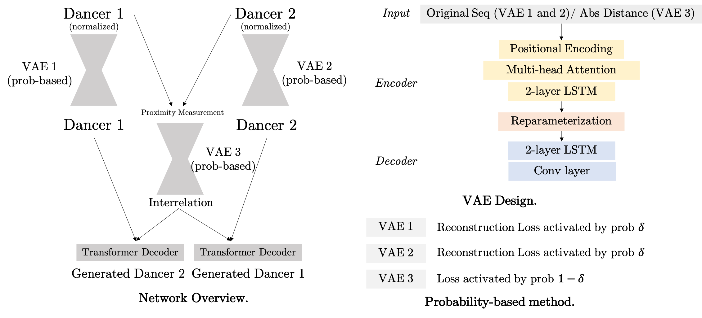
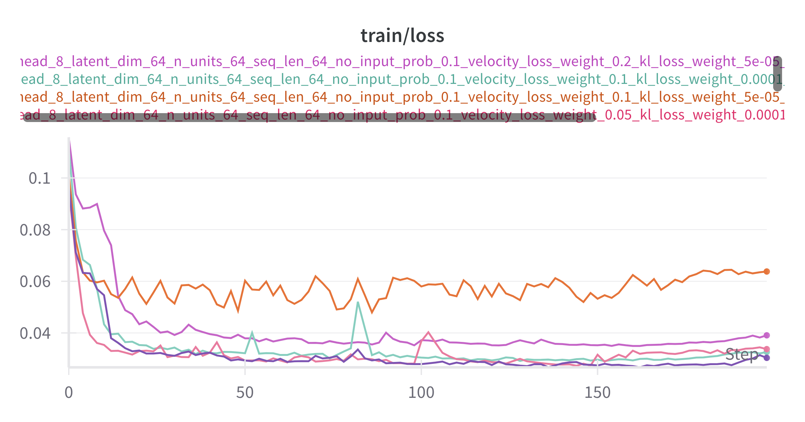
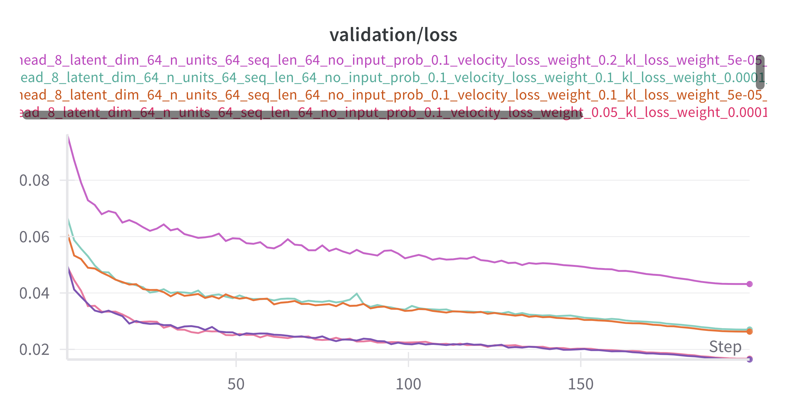

# Probability-and-Attention-based VAE for Duet Generation 

## Motivation
Transformers are advanced machine learning models that use attention mechanisms to process sequence data efficiently. They focus on relationships between all parts of the sequence simultaneously, making them faster and more effective at capturing complex patterns than traditional models like RNNs. Variational Autoencoders are generative models that learn to encode data into a compressed latent space and then decode it back to the original space. They balance a reconstruction loss, ensuring data similarity, with a KL divergence loss, promoting distributional similarity to a prior, facilitating data generation and representation learning.

We aim to utilize both models to generate sequential dancing data by taking advantage of attention mechanism and probabilistic generative capabilities. The transformer's ability to model interactions between sequence elements at different positions allows us to capture the dynamic interplay between dancers' movements over time. On the other hand, the variational autoencoder (VAE) will enable us to generate new dance sequences that are both diverse and realistic by learning a latent space representation of dance movements. This integrated approach allows the model to not only understand the complex patterns in dance but also to innovate by generating movements that maintain the fluidity and expressiveness essential to human-like dance performances.

## Network Design

The network consists of three VAEs designated as VAE 1, VAE 2, and VAE 3. Each VAE processes different aspects of dance movement sequences, with VAE 1 and VAE 2 handling individual sequences and VAE 3 focusing on the absolute distances between dancers, capturing their spatial interactions.


## Input and Output
- **Input**: Sequences for dancer 1 and dancer 2, with shape `[seq_length, num_joints, dim]`, the time window for this sequence is `[t, t + seq_length]`.
- **Output**: Predicted sequence in the next time step with same shape as input `[seq_length, num_joints, dim]`, and the time window is `[t + 1, t + 1 + seq_length]`.

### VAE
- **Positional Encoding**: This component is crucial as it provides the model with information about the sequence order of the dance movements, which is essential for understanding the temporal dynamics of the dance.
- **Multi-head Attention**: It enables the model to focus on different parts of the dance sequence simultaneously, improving the ability to model complex dependencies.
- **2-layer LSTM**: These layers are part of the VAEs’ encoders and decoders, helping to capture the temporal dependencies and nuances in dance movements over time.
- **Reparameterization**: This step in the VAEs allows for generating new dance sequences by sampling from the learned distribution in the latent space, ensuring variability and creativity in generated dance movements.
- **Conv layer**: A convolutional layer in the decoder helps to smooth the output from the encoder, an important aspect of performances.

### Transformer Decoder for Data Generation
We utilize standard transformer decoder to generate data based on both its own input sequence and context provided by three VAEs. In the forward pass of this module,
- The input sequence is reshaped and processed through the linear transformation to match the expected dimensionality for the transformer layers.
- Positional encodings are added to the transformed input to incorporate temporal information.
- Call the official `nn.TransformerDecoder` API, with `tgt` being original sequence and `memory` being the summation of the output from VAE for single dancer and VAE for duet. For example, to generate dancer 2, `tgt` would be the original dancer 2 data, `memory` would be the summation of VAE 1 output and VAE 3 output.
- The output from the transformer decoder is then passed through a final linear layer to ensure it has the correct shape and properties to match the expected output format.
- Finally, the output is reshaped to ensure it matches the original input's structure.

### Probability-based Method
During the experiment, we observed that supervising only the output of the Transformer Decoder resulted in suboptimal reconstruction performance. To enhance the reconstruction accuracy of the individual dancer VAEs, we introduced a probability-based method. This approach selectively optimizes either VAE 1 or VAE 2 with a certain probability, effectively focusing the optimization process on improving the reconstruction loss for single dancers. This strategy ensures that each VAE can learn detailed and accurate representations independently, thereby improving the overall quality of the model's output.

### Losses
- MSE Loss: This is a standard loss used to measure the average squared difference between the predicted outputs and the actual target values. It effectively quantifies the accuracy of the model's predictions by penalizing the error between the predicted and actual dancer positions. For simplified models, where the focus is on directly optimizing the Variational Autoencoders (VAEs) for individual dancers, MSE is computed between the VAE outputs and the actual dancer data. In more complex scenarios, MSE is calculated between the Transformer Decoder outputs (predicted dancer movements) and the corresponding targets.
- KL Divergence Loss: This loss component is crucial for the training of VAEs. It measures the difference between the learned distribution (represented by the means and log variances of the latent variables) and the prior distribution, typically assumed to be a standard normal distribution. This loss ensures that the latent space representations do not stray too far from a normal distribution, which helps in regularizing the model and avoiding overfitting. It also facilitates the generation process by ensuring that the latent space has good coverage and that similar inputs lead to similar outputs in a continuous latent space.
- Velocity Loss: Designed to maintain the continuity and fluidity of motion between consecutive frames, this loss calculates the first order difference between frames, referred to as velocity, and then measures how much this velocity changes over a specified number of frames (denoted by `frames`). The loss is computed as the norm of the difference in velocities, which encourages smoother transitions and more realistic motion in the generated dance sequences. In our experiment, Velocity Loss played an important role in regularizing the result to be "rational" and not being crazy. The model also behaves sensitive to the parameters of this loss, including `frames` and `loss_weight`.

### Learning curves

To get the best model weights, we tested different hyperparameter configurations. Below are training loss and validation loss for 5 configurations for the model, with the best configuration being
```python
linear_num_features = 64
n_head = 8
latent_dim = 64
n_units = 64
seq_len = 64
no_input_prob = 0.1
velocity_loss_weight = 0.05
kl_loss_weight = 0.00005
mse_loss_weight = 0.5
frames = 1
```
<div align="center">
    
    
</div> 