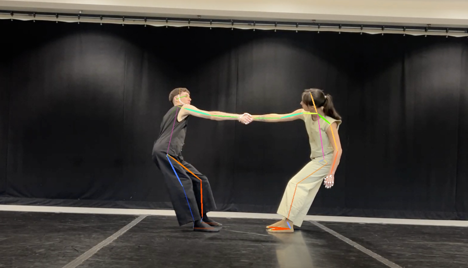
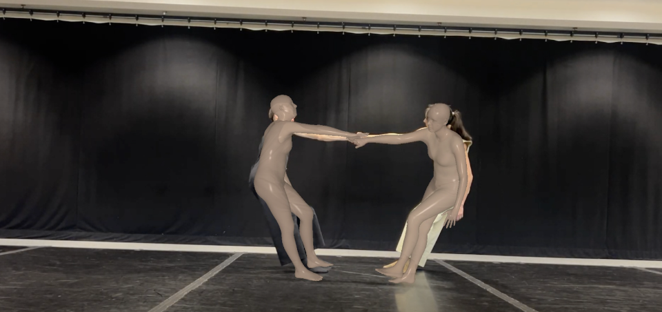
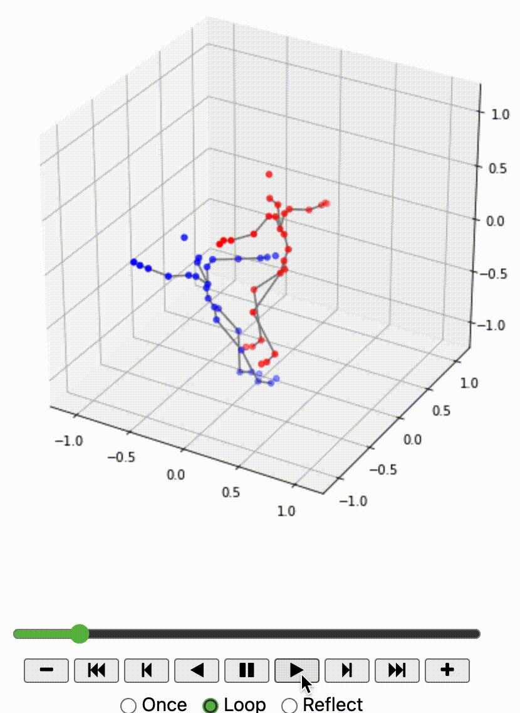

## Data preprocessing
High-quality training data is essential for an AI model. In order to extract 3D joints (point cloud) data from videos provided by Ilya, we have tested two open-source tools for pose estimation, [OpenPose](https://github.com/Devashi-Choudhary/AI-Dance-based-on-Human-Pose-Estimation) and [AlphaPose](https://github.com/MVIG-SJTU/AlphaPose). 

We had no luck in managing configuration of OpenPose, so we switched to AlphaPose, which provided many different kinds of models for both 2D and 3D inference. 

### AlphaPose Installation
I would like to thank Mariel for providing the computing resources on Perlmutter. The installation document of AlphaPose on Perlmutter can be found [here](INSTALL.md). I have to admit that it focuses on a specific server, but I believe that it can be applied to any Linux server with CUDA driver version >= 12.0.

### Model Inference

#### 2D

I have tested with [this model](https://github.com/MVIG-SJTU/AlphaPose/blob/master/configs/halpe_136/resnet/256x192_res50_lr1e-3_2x-dcn-regression.yaml) for 2D keypoints inference. There are many different models trained on different datasets, so feel free to explore the model zoo to find the one that meets your need!

#### 3D

AlphaPose utilizes [Hybrik](https://github.com/MVIG-SJTU/AlphaPose/blob/master/configs/smpl/256x192_adam_lr1e-3-res34_smpl_24_3d_base_2x_mix.yaml) for body mesh estimation. This image shows the body mesh using [SMPL](https://github.com/Jeff-sjtu/HybrIK).

 

AlphaPose will also extract 3D body joints for every person in every frame. The workflow includes:
- Use YOLO to detect body instances in the frame
- Pass results (boxes) from YOLO and original image to the Simple3DPoseBaseSMPLCam model
- Get the inference result of 3D joints, move the first joint to `(0, 0, 0)`

Therefore, in order to keep the interaction between the dancers, we remove [this line](https://github.com/MVIG-SJTU/AlphaPose/blob/master/alphapose/models/simple3dposeSMPLWithCam.py#L325) in the model. Below shows the original unprocessed data.

    

 

Please check out `preprocessing.ipynb` for detailed processing of raw data (many thanks to Luis!), which addresses:
- missing frames
- frames with only one person / more than two persons
- index matching
- jitter

Processed data:

    

 

## Raw data link
This [link](https://drive.google.com/drive/folders/1QkkAjVaKEuPBDzz7mN1BVYxUYZaYdtJF?usp=sharing) provides the raw json data extracted from AlphaPose.
