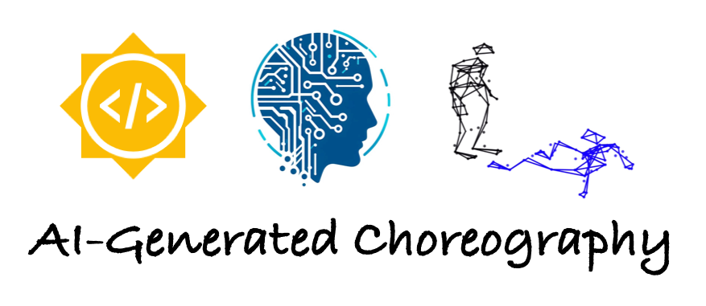

# ChoreoAI

    

## Background
While the fields of technology and dance have historically not often intersected, recent years have seen the advent of AI-generated choreography using models trained on motion capture of a single dancer. This project will expand the state-of-the-art in this intersectional field by exploring duets featuring pairs of dancers, enabling choreography that features authentic interactions between humans & AI models.

## Task ideas
- Extract pose information from curated videos of dance duets
- Train a GNN and/or Transformer model to analyze this data and generate new duet interaction ideas

## Expected results
- Create a dataset of dynamic point-cloud data corresponding to extracted motion capture poses from videos of dance duets
- Train an AI model that can generate the movements of Dancer #2 conditioned on the inputs of Dancer #1 and/or invent new, physically-plausible duet phrases
- If time permits: Learn key relationships between parts of the body of each dancer that are integral to the dynamics of the duet
- We will collaborate with the original dancers to use the model outputs to inspire new performance material

## Environment Setup
To ensure reproducibility of the choreography analysis and machine learning experiments, please follow these steps to set up your local environment.
-Prerequisites
Python 3.10 is recommended.
Virtual Environment: It is highly recommended to use venv or conda to manage dependencies.
-Installation
# Clone the repository
git clone https://github.com/humanai-foundation/ChoreoAI.git
cd ChoreoAI

# Create a virtual environment
python -m venv venv

# Activate the environment
# On macOS/Linux:
source venv/bin/activate
# On Windows:
.\venv\Scripts\activate

# Upgrade pip and install dependencies
pip install --upgrade pip
pip install -r requirements.txt
-Special note on PyTorch & Hardware
The requirements.txt file includes torch and torch-geometric. Depending on your hardware (CPU vs. NVIDIA GPU), you may need to install a specific version of PyTorch. If the default installation does not detect your GPU, please refer to the official PyTorch guide.

## Projects
| Contributor | Approach | Repository Link | Blog Post |
|-----------------|-----------------|-----------------|-----------------|
| Luis Zerkowski  | Graph Neural Network  | [Repo Link](https://github.com/humanai-foundation/ChoreoAI/tree/main/ChoreoAI_Duet_ChorAIgraphy_Luis_Zerkowski) | [Blog Post](https://medium.com/@luisvz)
| Zixuan Wang  | Transformer and VAE  | [Repo Link](https://github.com/humanai-foundation/ChoreoAI/tree/main/ChoreoAI_Zixuan_Wang)  | [Blog Post](https://wang-zixuan.github.io/posts/2024/gsoc_2024)